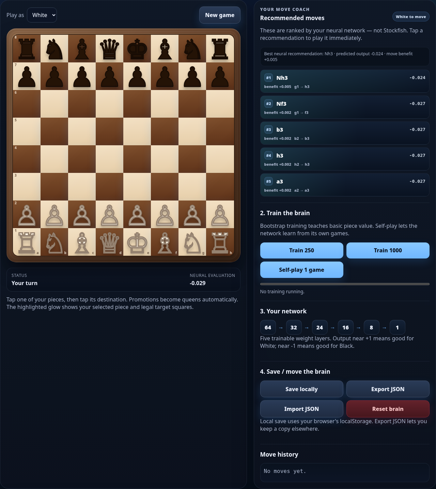
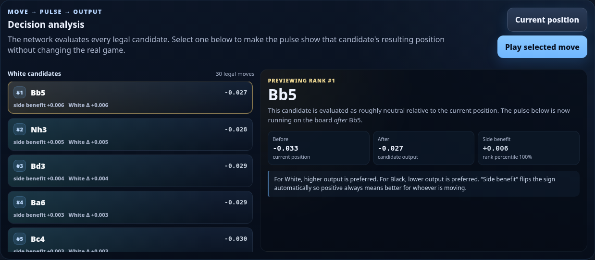
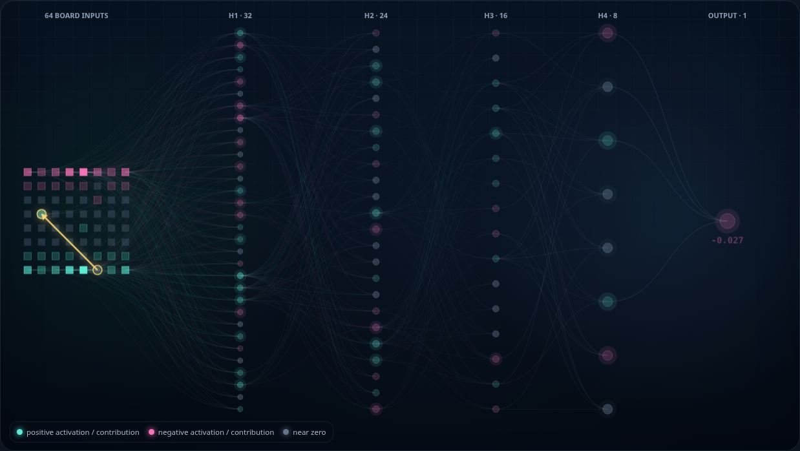
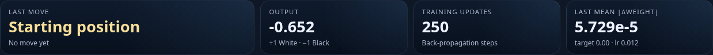
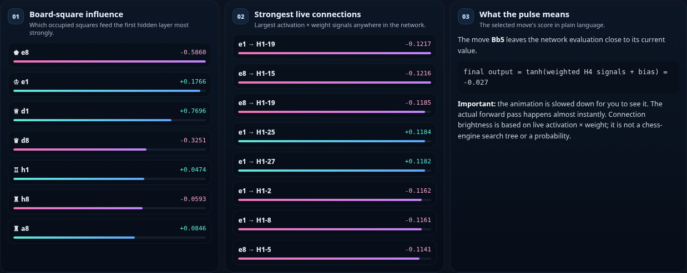
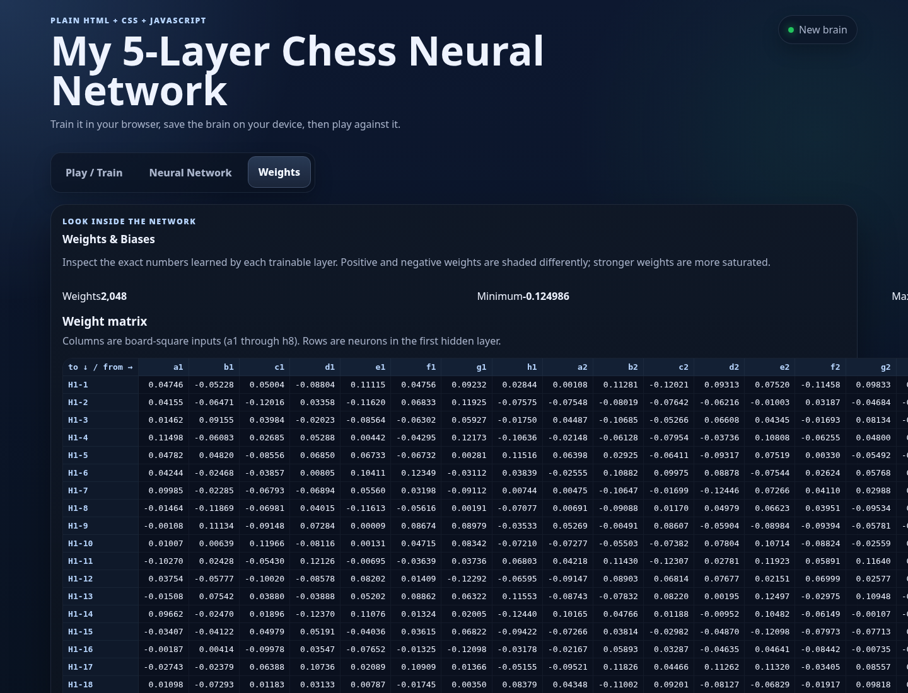

# My 5-Layer Chess Neural Network

A small, fully offline chess-learning project written in **plain HTML, CSS and JavaScript**.

The goal of this project is not to reproduce Stockfish or AlphaZero. The goal is to make a neural chess player that is small enough to understand, inspect, modify, train, and run directly on an iPad.

The neural network, forward propagation, back-propagation, move evaluation, training loop, weight storage and visualization are all implemented in [`app.js`](app.js). The bundled [`chess.min.js`](chess.min.js) library is used only for chess rules: legal moves, check, checkmate, castling, promotion, draw detection, and board state.

---

## Contents

- [Quick start on iPad / iSH](#quick-start-on-ipad--ish)
- [The three main tabs](#the-three-main-tabs)
- [What the neural network actually is](#what-the-neural-network-actually-is)
- [How a chessboard becomes 64 numbers](#how-a-chessboard-becomes-64-numbers)
- [How forward propagation works](#how-forward-propagation-works)
- [How a move becomes a recommendation](#how-a-move-becomes-a-recommendation)
- [How the neural pulse relates to a move](#how-the-neural-pulse-relates-to-a-move)
- [What the weights mean](#what-the-weights-mean)
- [How the network learns](#how-the-network-learns)
- [The four ways this app trains](#the-four-ways-this-app-trains)
- [What back-propagation is doing mathematically](#what-back-propagation-is-doing-mathematically)
- [How to read the Neural Network tab](#how-to-read-the-neural-network-tab)
- [How to read the Weights tab](#how-to-read-the-weights-tab)
- [Should we use more layers?](#should-we-use-more-layers)
- [What I would improve before adding layers](#what-i-would-improve-before-adding-layers)
- [A sensible Version 2 roadmap](#a-sensible-version-2-roadmap)
- [Experiments to try](#experiments-to-try)
- [Important limitations](#important-limitations)
- [Where to modify the code](#where-to-modify-the-code)

---

# Quick start on iPad / iSH

Unzip the project, open iSH, and change into the project directory:

```sh
cd my_chess_neural_network_documented_complete
```

If Python is not already installed:

```sh
apk update
apk add python3
```

Start the local web server:

```sh
chmod +x start.sh
./start.sh
```

or:

```sh
python3 -m http.server 8080
```

Open Safari and visit:

```text
http://localhost:8080
```

Everything required by the chess application is local. `chess.min.js`, `app.js`, `styles.css`, and the HTML page are all bundled with the project.

---

# The three main tabs

The app has three views:

1. **Play / Train** — play chess, see recommendations, train the network, and save the brain.
2. **Neural Network** — inspect candidate moves, watch activations flow through the layers, and manually back-propagate a position.
3. **Weights** — inspect the actual matrices and biases stored in the network.

## Play / Train



The right-hand **Recommended moves** panel evaluates every legal move and displays the best moves according to this neural network.

This is deliberately *not* a Stockfish recommendation. If the network is untrained, its recommendations may be poor or almost random. As training changes the weights, its preferred moves can change.

---

# What the neural network actually is

The current architecture is:

```text
64 board inputs
      │
      ▼
32 neurons
      │
      ▼
24 neurons
      │
      ▼
16 neurons
      │
      ▼
8 neurons
      │
      ▼
1 output
```

Or, more compactly:

```text
64 → 32 → 24 → 16 → 8 → 1
```

There are **five trainable transformations**:

| Trainable layer | Shape | Weights | Biases | Parameters |
|---|---:|---:|---:|---:|
| Layer 1 | 64 → 32 | 2,048 | 32 | 2,080 |
| Layer 2 | 32 → 24 | 768 | 24 | 792 |
| Layer 3 | 24 → 16 | 384 | 16 | 400 |
| Layer 4 | 16 → 8 | 128 | 8 | 136 |
| Layer 5 | 8 → 1 | 8 | 1 | 9 |
| **Total** | | **3,336** | **81** | **3,417** |

The input itself is not trainable. Some people would therefore describe this as a five-layer trainable network; other conventions count the input and would call it six layers including the input layer. Throughout this project, **“5-layer network” means five sets of trainable weights**.

The final output is bounded by `tanh()`:

```text
-1.0                0.0                +1.0
Black advantage     roughly equal      White advantage
```

It is an **evaluation**, not a win probability.

For example:

```text
+0.72  strongly favors White according to the network
+0.08  slightly favors White
 0.00  approximately neutral
-0.10  slightly favors Black
-0.83  strongly favors Black
```

The scale is learned and is not calibrated to centipawns.

---

# How a chessboard becomes 64 numbers

The function responsible for this is:

```text
encodeBoard(chess)
```

Each of the 64 squares becomes exactly one number.

The piece codes are:

| Piece | Raw code | Encoded magnitude |
|---|---:|---:|
| Pawn | 1 | 1/6 ≈ 0.167 |
| Knight | 2 | 2/6 ≈ 0.333 |
| Bishop | 3 | 3/6 = 0.500 |
| Rook | 4 | 4/6 ≈ 0.667 |
| Queen | 5 | 5/6 ≈ 0.833 |
| King | 6 | 6/6 = 1.000 |

White pieces are positive and Black pieces are negative.

So:

```text
empty square  =  0.000
White pawn    = +0.167
Black pawn    = -0.167
White knight  = +0.333
Black knight  = -0.333
...
White king    = +1.000
Black king    = -1.000
```

A position therefore becomes a vector:

```text
x = [a1, b1, c1, ..., f8, g8, h8]
```

containing 64 values.

### Example: `Nf3`

Suppose White moves the knight from `g1` to `f3`.

Before:

```text
g1 = +0.333
f3 =  0.000
```

After:

```text
g1 =  0.000
f3 = +0.333
```

Those changed inputs alter Layer 1. Layer 1 then changes Layer 2, which changes Layer 3, and so on until the final evaluation changes.

Importantly, **the whole 64-square board is evaluated after the move**, not merely the two changed squares.

---

# How forward propagation works

The forward pass is implemented in:

```text
NeuralNet.forward(x)
```

For every neuron, the network performs a weighted sum:

```text
z = bias + Σ(weight × previous_activation)
```

and then applies:

```text
activation = tanh(z)
```

So one neuron in Hidden Layer 1 looks conceptually like:

```text
a1 ── weight ──┐
b1 ── weight ──┤
c1 ── weight ──┤
...             ├── weighted sum + bias ── tanh ── H1 neuron
g8 ── weight ──┤
h8 ── weight ──┘
```

Every Hidden Layer 1 neuron sees all 64 board inputs.

Then every Hidden Layer 2 neuron sees all 32 Layer 1 outputs:

```text
64 inputs
   │
   │ W1
   ▼
32 activations
   │
   │ W2
   ▼
24 activations
   │
   │ W3
   ▼
16 activations
   │
   │ W4
   ▼
8 activations
   │
   │ W5
   ▼
1 evaluation
```

Mathematically:

```text
a0 = input board

z1 = W1 × a0 + b1
a1 = tanh(z1)

z2 = W2 × a1 + b2
a2 = tanh(z2)

...

z5 = W5 × a4 + b5
output = tanh(z5)
```

The network contains only **3,336 multiplications by weights per forward pass**, plus additions and activation functions. That is one reason this design runs comfortably in ordinary JavaScript.

---

# How a move becomes a recommendation

The move-ranking logic is implemented by:

```text
rankLegalMoves(net, chess)
```

For every legal candidate move:

1. Temporarily play the move.
2. Encode the resulting board.
3. Run the resulting board through the neural network.
4. Record the output.
5. Undo the move.
6. Compare the result with every other legal move.

For White:

```text
higher output = preferred
```

For Black:

```text
lower output = preferred
```

Imagine this position has four legal candidates:

```text
Current evaluation: +0.05

Nf3 → +0.19
e4  → +0.14
d4  → +0.08
Na3 → -0.03
```

If White is moving, the network ranks:

```text
1. Nf3   +0.19
2. e4    +0.14
3. d4    +0.08
4. Na3   -0.03
```

The app also calculates **side benefit**.

For White:

```text
side benefit = candidate score - current score
```

For Black:

```text
side benefit = -(candidate score - current score)
```

That gives the user interface one convenient rule:

```text
positive side benefit = better for whoever is moving
negative side benefit = worse for whoever is moving
```

### A very important limitation

This is currently a **one-ply evaluation**.

The network asks:

> “What does the board look like immediately after this move?”

It does **not** yet ask:

> “What is my opponent's strongest response to this move?”

That limitation matters more for playing strength than adding another dense layer.

---

# How the neural pulse relates to a move

The Neural Network tab lets you select a legal candidate without committing it to the actual game.



When you select a candidate:

```text
Current position
      │
      ├── temporarily make candidate move
      │
      ▼
Resulting board
      │
      ▼
encode 64 squares
      │
      ▼
forward propagation
      │
      ▼
final evaluation
```

The pulse visualization is showing the **real activations calculated by `forward()`**.



The gold move arrow identifies the move being previewed.

The columns show:

```text
64 inputs → H1:32 → H2:24 → H3:16 → H4:8 → output:1
```

### Node color

The visualizer separates:

- positive activation,
- negative activation,
- activation near zero.

A highly saturated node means its absolute activation is relatively large.

### Connection brightness

The visualizer cannot draw all connections with equal emphasis without becoming unreadable.

Instead it highlights the strongest live contributions.

For a connection:

```text
contribution = source activation × connection weight
```

For example:

```text
source activation = +0.60
weight            = +0.80
contribution      = +0.48
```

versus:

```text
source activation = +0.03
weight            = +0.80
contribution      = +0.024
```

The first connection is much more relevant to *this particular forward pass*, even though both use the same weight.

This is why the pulse changes when the board changes even if the weights have not changed.

### The animation is deliberately slowed down

The real JavaScript forward pass happens extremely quickly.

The visual pulse is a slowed representation of the already-computed layer sequence:

```text
input → H1 → H2 → H3 → H4 → output
```

It is not showing the processor literally spending hundreds of milliseconds inside each layer.

---

# What the weights mean

A weight is a trainable number connecting one neuron to another.

For Layer 1:

```text
weight[e4 → H1-7]
```

means:

> “How strongly should the numeric value on square e4 affect Hidden Layer 1 neuron 7?”

If:

```text
e4 activation = +0.167
weight         = +0.90
```

the contribution is:

```text
+0.167 × +0.90 ≈ +0.150
```

But if a Black pawn occupied e4:

```text
e4 activation = -0.167
weight         = +0.90
```

the contribution becomes:

```text
-0.150
```

So even a single first-layer weight does not simply mean:

> “e4 is good.”

It means:

> “When this signed square input is present, push this hidden feature in this direction.”

Later layers make interpretation even more distributed.

A chess concept such as:

```text
"White has a strong kingside attack"
```

does not have to live in one neuron. It can emerge from a pattern across many neurons and many weights.

---

# How the network learns

Learning means:

> **Change the weights so the network output moves closer to a target value.**

The app has a function:

```text
net.trainOne(input, target, learningRate)
```

Suppose:

```text
network output = +0.20
training target = +0.80
```

The network is underestimating White's position.

Training computes how each weight contributed to the error and nudges the weights in a direction that tends to increase the output for that training example.

If instead:

```text
network output = +0.70
training target = -0.50
```

training nudges the weights in the opposite direction.

The network is therefore not storing chess positions as a lookup table. It is changing a shared system of thousands of parameters.

The same weights are reused for every board.

---

# The four ways this app trains

There are four distinct learning sources.

## 1. Bootstrap training

Buttons:

```text
Train 250
Train 1000
```

Bootstrap training generates legal positions and uses a simple handcrafted teacher.

The teacher values material approximately as:

```text
pawn   = 1
knight = 3
bishop = 3.25
rook   = 5
queen  = 9
king   = 0
```

White material is positive. Black material is negative.

Check adds a small adjustment.

Then the score is compressed into the `-1 ... +1` range using:

```text
target = tanh(material_score / 5)
```

Checkmate is explicitly:

```text
White wins = +1
Black wins = -1
```

and draws are:

```text
0
```

During generated bootstrap games, captures are deliberately selected more often when available so that the trainer sees more positions with unequal material.

The bootstrap learning rate is currently:

```text
0.012
```

### What bootstrap training teaches well

It can begin to learn:

- losing a queen is usually bad,
- gaining material is usually good,
- checkmate is decisive,
- White advantage should push output positive,
- Black advantage should push output negative.

### What bootstrap training does *not* teach very well

The teacher does not meaningfully reward:

- center control,
- king safety before check,
- pawn structure,
- passed pawns,
- development,
- space,
- piece activity,
- weak squares,
- tactical threats several moves away.

A deeper network cannot magically learn concepts that its training targets never reward.

That is an important reason **more layers are not the first upgrade I recommend**.

---

## 2. Self-play

The **Self-play 1 game** button makes the network play both sides.

The current loop:

1. Stores every position it visits.
2. Usually chooses its best neural move.
3. Uses a random move approximately 25% of the time for exploration.
4. Stops at game end or 100 plies.
5. Produces a final result.
6. Trains all stored positions toward that result.

If checkmate occurs:

```text
White win → +1
Black win → -1
```

If a normal draw occurs:

```text
0
```

If the 100-ply limit is reached, the simple material teacher supplies a fallback score.

The self-play learning rate is:

```text
0.0025
```

This resembles a simple form of **Monte Carlo value learning**: positions are trained toward an eventual outcome.

It is intentionally much simpler than AlphaZero-style self-play.

---

## 3. Completed human-vs-AI games

While you play the AI, the app stores the positions encountered during the game.

When the game ends, every stored position is trained toward the final result:

```text
White win → +1
draw      → 0
Black win → -1
```

The current learning rate for completed human games is:

```text
0.002
```

This means the network can continue changing as you actually play it.

One limitation is **credit assignment**.

If a game contains 80 positions and White eventually wins, the current simple system teaches all 80 positions toward the White-win target even though some earlier positions may have been equal or objectively bad for White.

A future TD-learning system can handle this more intelligently.

---

## 4. Manual back-propagation

The Neural Network tab contains a **Manual Learning Lab**.

You choose:

```text
Target:       -1.00 ... +1.00
Learning rate: 0.001 ... 0.050
```

and press:

```text
Backpropagate current position
```

If a candidate move is being previewed, the previewed candidate position is trained instead.

This gives you a very direct experiment:

```text
1. Select a position.
2. Note its output.
3. Choose a target.
4. Back-propagate once.
5. Watch the output change.
6. Open Weights.
7. Inspect the changed parameters.
```

Use manual training carefully.

Repeatedly forcing one position toward `+1` with a high learning rate can overfit that example and disturb evaluations of other positions.

For experimentation, a learning rate around:

```text
0.005 – 0.010
```

is a reasonable starting point.

---

# What back-propagation is doing mathematically

The loss is squared error:

```text
loss = (prediction - target)²
```

If:

```text
prediction = 0.20
target     = 0.80
```

then:

```text
loss = (0.20 - 0.80)²
     = 0.36
```

Because the output uses `tanh`, the output error signal is:

```text
delta_output =
    2 × (prediction - target)
      × (1 - prediction²)
```

For our example:

```text
delta_output =
    2 × (0.20 - 0.80)
      × (1 - 0.20²)

= -1.152
```

Suppose a neuron in Hidden Layer 4 has activation:

```text
a = +0.50
```

Then the gradient contribution for its output weight is approximately:

```text
gradient = delta_output × a
         = -1.152 × 0.50
         = -0.576
```

With learning rate:

```text
0.01
```

gradient descent performs:

```text
new_weight =
    old_weight - learning_rate × gradient

= old_weight - 0.01 × (-0.576)

= old_weight + 0.00576
```

That connection becomes slightly more positive.

The error is then propagated backward through the earlier layers:

```text
output error
     │
     ▼
H4 error
     │
     ▼
H3 error
     │
     ▼
H2 error
     │
     ▼
H1 error
```

The hidden-layer error uses the downstream weights and the `tanh` derivative:

```text
previous_delta =
    (Wᵀ × delta)
    × (1 - previous_activation²)
```

Finally, every dense-layer weight is updated using:

```text
weight_change =
    learning_rate
    × delta_of_destination
    × activation_of_source
```

and:

```text
weight -= weight_change
bias   -= learning_rate × delta
```

This is real back-propagation implemented directly in JavaScript. There is no TensorFlow or PyTorch hiding these steps.

---

# Watching weight updates happen

After bootstrap training, the network-update counter increases.



The app records:

- total calls to `trainOne()`,
- target used for the most recent update,
- learning rate,
- output before the update,
- mean absolute weight change.

The last statistic:

```text
mean |Δweight|
```

helps answer:

> “Did training really change the network?”

A value such as:

```text
2.4e-5
```

means the average absolute weight movement in that update was approximately:

```text
0.000024
```

Small individual updates are normal. Neural networks generally learn through many small changes.

---

# How to read the Neural Network tab

The neural tab is both a move-analysis tool and a learning microscope.

## Candidate list

It evaluates all legal moves and ranks the strongest candidates.

You can select a move without playing it.

The app copies the current board, makes that hypothetical move, and runs the resulting position through the network.

## Before / after

For a selected move it reports:

```text
Before: current board evaluation
After:  board evaluation after candidate
```

and:

```text
Side benefit
```

which is oriented so positive always means better for the player to move.

## Neural pulse

The pulse shows the real activations of:

```text
input → H1 → H2 → H3 → H4 → output
```

## Layer cards

Each layer reports:

- strongest activation,
- mean absolute activation,
- how many neurons are meaningfully active.

These are useful signs of network behavior.

If nearly every `tanh` neuron sits close to:

```text
+1 or -1
```

the network may be saturating, which can make learning slower because the `tanh` derivative becomes small.

## Board-square influence



This panel examines occupied squares and summarizes how strongly each square is feeding Hidden Layer 1 in the current forward pass.

This is useful for understanding *which inputs are active*, but it should not be interpreted as a perfect causal explanation of the chess evaluation.

## Strongest live connections

This sorts live connections by:

```text
|activation × weight|
```

and shows the strongest signals currently travelling through the network.

Again, this is a useful internal diagnostic, not a mathematically complete attribution system such as integrated gradients or SHAP.

---

# How to read the Weights tab



The Weights tab lets you inspect each trainable matrix:

```text
Layer 1: 64 → 32
Layer 2: 32 → 24
Layer 3: 24 → 16
Layer 4: 16 → 8
Layer 5: 8 → 1
```

For Layer 1 the input columns correspond directly to:

```text
a1, b1, c1, ... h8
```

A row corresponds to one Hidden Layer 1 neuron.

So a cell is literally:

```text
weight[square → hidden neuron]
```

For example:

```text
column e4
row H1-12
```

is the weight connecting the encoded value of square `e4` to Hidden Layer 1 neuron 12.

The tab also reports:

- minimum weight,
- maximum weight,
- mean weight,
- mean absolute weight,
- standard deviation,
- training update count,
- latest mean absolute weight change,
- biases.

### Do not expect weights to become human-readable chess rules

You should not expect to open the table and see:

```text
"this neuron = knight outpost"
```

Dense networks tend to use distributed representations.

A useful feature can be represented by many neurons at once, while a single neuron can participate in several features.

---

# Should we use more layers?

## Short answer

**Not yet.**

The current network already has:

```text
5 trainable layers
3,417 trainable parameters
4 hidden layers
```

For the current 64-number input representation, depth is not the main bottleneck.

Adding layers now would give the model more mathematical capacity, but it would *not* fix the three most important weaknesses:

1. **The board representation is too compressed.**
2. **Move selection only looks one move ahead.**
3. **The training targets contain limited chess knowledge.**

Those improvements are more likely to improve chess quality than simply changing:

```text
64 → 32 → 24 → 16 → 8 → 1
```

into something like:

```text
64 → 64 → 48 → 32 → 24 → 16 → 8 → 1
```

## Why more depth can actually make this version harder to train

Every hidden layer currently uses:

```text
tanh()
```

Its derivative is:

```text
1 - activation²
```

Near:

```text
activation = +1 or -1
```

that derivative approaches zero.

With more `tanh` layers, back-propagated gradients can become progressively smaller.

This is the classic **vanishing-gradient** problem.

Modern deep networks often use techniques such as:

- ReLU / GELU-like activations,
- residual connections,
- normalization,
- much larger training datasets,
- adaptive optimizers.

Our project deliberately avoids that machinery so the learning code remains understandable.

## Why keeping the current depth is valuable

The current architecture is small enough that:

- you can inspect every matrix,
- training is responsive in Safari,
- evaluating every legal move is cheap,
- exporting the brain produces a manageable JSON file,
- the pulse visualization remains understandable,
- back-propagation is easy to trace.

That is a major educational advantage.

---

# What I would improve before adding layers

## Priority 1 — Better board encoding

This is the biggest architectural improvement I would make.

Right now a square contains one ordinal number:

```text
pawn   = 1/6
knight = 2/6
bishop = 3/6
...
king   = 6/6
```

That accidentally tells the network that the piece identities lie on one numeric line.

For example, it structurally sees:

```text
bishop = 0.5
queen  = 0.833
```

rather than treating “bishop” and “queen” as independent categories.

A better representation uses **12 binary piece planes**:

```text
White pawn plane
White knight plane
White bishop plane
White rook plane
White queen plane
White king plane

Black pawn plane
Black knight plane
Black bishop plane
Black rook plane
Black queen plane
Black king plane
```

Each plane has 64 squares:

```text
12 × 64 = 768 inputs
```

Then add state information such as:

```text
side to move
White kingside castling right
White queenside castling right
Black kingside castling right
Black queenside castling right
en-passant information
```

This gives the network a much cleaner chess representation.

### My recommendation

Keep approximately the **same number of trainable layers**, but improve the input.

For example conceptually:

```text
~780 inputs
    ↓
64
    ↓
32
    ↓
16
    ↓
8
    ↓
1
```

This is much more meaningful than adding several extra layers to the current 64-scalar representation.

It will be slower, but still realistic for an educational iPad project if implemented carefully.

---

## Priority 2 — Look ahead one opponent reply

This would probably produce the largest immediate improvement in move quality.

Current:

```text
my move
   ↓
evaluate
```

Better:

```text
my move
   ↓
opponent's best reply
   ↓
evaluate
```

For White, conceptually:

```text
score(candidate) =
    minimum neural evaluation
    over all Black replies
```

because Black will choose the reply that is worst for White.

Then White chooses the candidate with the highest resulting score.

This is a two-ply minimax search:

```text
White candidate A
   ├── Black reply 1 → +0.30
   ├── Black reply 2 → -0.40  ← Black chooses this
   └── Black reply 3 → +0.10
candidate A score = -0.40

White candidate B
   ├── Black reply 1 → +0.05
   ├── Black reply 2 → +0.02  ← Black chooses this
   └── Black reply 3 → +0.20
candidate B score = +0.02

White should choose B.
```

Without this search, Candidate A might incorrectly appear attractive if its immediate position looked excellent.

I would add this **before making the network deeper**.

---

## Priority 3 — Better learning targets

The current material teacher is useful for bootstrapping but simplistic.

Possible improvements include teacher bonuses for:

- mobility,
- center occupation,
- developed minor pieces,
- king safety,
- doubled pawns,
- passed pawns,
- rook activity,
- bishop pair,
- queen safety.

But handcrafted rules eventually become another chess engine.

A better learning-oriented approach is **temporal-difference learning**.

Instead of training every position to the final game result, use the next position to update the current position.

Conceptually:

```text
target(current position) =
    reward + gamma × value(next position)
```

For a nonterminal move:

```text
reward ≈ 0
```

so:

```text
target ≈ value(next position)
```

Near checkmate:

```text
reward = ±1
```

This propagates information backward through games more gradually.

An even better educational extension is TD(λ), which distributes credit across several recent positions.

---

## Priority 4 — Experience replay

Currently a training position is generally used and then forgotten.

An experience-replay buffer would store examples:

```text
(position, target)
```

and repeatedly sample mixed old/new experiences.

Benefits:

- reduces catastrophic forgetting,
- mixes different game phases,
- prevents training from depending too heavily on the most recent game,
- allows multiple learning passes over valuable examples.

Even a small browser-friendly buffer of:

```text
1,000 – 10,000 positions
```

could be useful.

It could be saved separately from the network weights.

---

## Priority 5 — Only then consider more depth

After improving representation, search and training, we can measure whether the model is underfitting.

Signs that more capacity may help:

- training loss remains high despite many diverse examples,
- predictions barely distinguish strategically different positions,
- more training no longer improves evaluation quality,
- hidden layers are not saturated but the model cannot fit richer targets.

At that point, widening layers is often the first experiment:

```text
64 → 48 → 32 → 24 → 12 → 1
```

rather than immediately adding several extra layers.

For a richer 12-plane board encoding, a somewhat wider network would make more sense.

---

# A sensible Version 2 roadmap

If the aim is to make this project substantially smarter while keeping it understandable on an iPad, I would do the upgrades in this order.

| Phase | Upgrade | Why |
|---|---|---|
| **1 — current** | 64 → 32 → 24 → 16 → 8 → 1 | Small, inspectable baseline |
| **2** | 12-plane piece encoding + game-state inputs | Gives the network cleaner chess information |
| **3** | 2-ply minimax / alpha-beta | Stops many obvious one-move tactical mistakes |
| **4** | Experience replay | Makes learning more stable |
| **5** | TD learning | Improves credit assignment through games |
| **6** | Wider network | Adds capacity when richer data justifies it |
| **7** | Optional policy head | Learns which moves deserve attention |
| **8** | Optional convolutional layers | Exploits the spatial structure of the board |

### Why convolution is interesting

Chess is spatial.

Patterns such as:

```text
pawn protects knight
rook on open file
bishop diagonal
king pawn shield
```

depend on local and geometric relationships.

A fully connected network has to learn these relationships separately for many squares.

A convolutional network can reuse spatial pattern detectors across the board.

However, implementing convolution and its back-propagation from scratch would make this educational project considerably larger.

I would therefore keep the dense network until the current learning system is thoroughly understood.

---

# Experiments to try

## Experiment 1 — Watch an untrained brain

1. Press **Reset brain**.
2. Look at Recommended Moves.
3. Open Neural Network.
4. Record the output.
5. Open Weights.

A brand-new network starts with random weights, so move rankings are mostly arbitrary.

This demonstrates that the application is not secretly using a chess engine for its neural recommendations.

---

## Experiment 2 — Bootstrap it

1. Reset.
2. Press **Train 250**.
3. Watch `Training updates`.
4. Re-open Recommended Moves.
5. Compare the new ranking with the old one.

The update counter should increase by approximately 250.

The weights and recommendations should change.

---

## Experiment 3 — Train one exact position manually

Find a position where White has a large material advantage.

Open Neural Network and note:

```text
output = ?
```

Set:

```text
target = +0.80
learning rate = 0.005
```

Back-propagate several times.

Watch the output move toward the target.

Then open Weights and observe:

```text
Training updates
Last mean |Δw|
```

This is one of the clearest demonstrations of neural learning.

---

## Experiment 4 — Compare two candidate pulses

In the Neural Network tab:

1. Select the #1 candidate.
2. Note the output and strongest connections.
3. Select a low-ranked candidate.
4. Compare the output and activation patterns.

You are looking at:

```text
same weights
different hypothetical board
different activations
different final evaluation
```

---

## Experiment 5 — Demonstrate one-ply weakness

Look for a position in which a move wins something immediately but allows a strong opponent reply.

The current move recommender may like the move because it only evaluates:

```text
position after my move
```

This experiment demonstrates exactly why search depth and neural-network depth are different concepts.

---

# Important limitations

This project is intentionally educational.

## 1. The network does not see all chess state

The current 64 inputs do not explicitly encode:

- whose turn it is,
- castling rights,
- en-passant square,
- repetition count,
- fifty-move counter.

`chess.js` knows this information for move legality, but the neural evaluation itself does not receive all of it as inputs.

That can make two strategically different states look identical to the network.

## 2. Piece representation is compressed

One scalar per square is simple, but 12 one-hot planes would be a cleaner machine-learning representation.

## 3. Recommendations are one-ply

The network does not currently search the opponent's best response.

## 4. Bootstrap knowledge is mainly material-based

Therefore the initial learner will be much better at learning:

```text
"winning a queen is good"
```

than:

```text
"a queenside pawn majority may become important 20 moves later"
```

## 5. Self-play is simple

It does not use:

- Monte Carlo Tree Search,
- policy/value dual heads,
- prioritized replay,
- massive parallel games,
- millions of positions.

That simplicity is intentional.

## 6. Neural influence is diagnostic, not a proof

A bright line means:

```text
activation × weight
```

is large for that connection.

It does not prove that the network has a human-readable concept attached to that line.

## 7. A lower loss is not automatically stronger chess

The model can become very good at imitating a simplistic teacher.

That does not mean the teacher itself is strategically strong.

Training quality depends on the quality of the target signal.

---

# Saving the brain

The network contains:

```text
sizes
weights
biases
trainingUpdates
lastUpdate
```

The app can save these in browser `localStorage`.

It can also export them to:

```text
chess_brain.json
```

This JSON file is the learned network.

You can:

```text
train → export → close app → reopen → import → continue training
```

A useful practice is to export checkpoints:

```text
brain_0000.json
brain_0250.json
brain_1000.json
brain_5000.json
```

Then you can compare how the recommendations evolve.

---

# Where to modify the code

Nearly all interesting machine-learning behavior lives in [`app.js`](app.js).

| Function / class | What it controls |
|---|---|
| `PIECE_CODE` | Current one-number-per-square representation |
| `MATERIAL_VALUE` | Bootstrap teacher's material values |
| `NeuralNet.constructor()` | Architecture and initial random weights |
| `NeuralNet.forward()` | Forward propagation |
| `NeuralNet.trainOne()` | Back-propagation and gradient descent |
| `encodeBoard()` | Converts chess position into network inputs |
| `teacherScore()` | Bootstrap training target |
| `evaluatePosition()` | Produces neural evaluation |
| `rankLegalMoves()` | Recommended-move ranking |
| `chooseMove()` | AI move selection |
| `trainBootstrap()` | Train 250 / Train 1000 |
| `selfPlayOneGame()` | Self-play training |
| `learnFromFinishedGame()` | Learning after your completed games |
| `renderNeuralNetwork()` | Live neural visualization |
| `renderWeights()` | Weights tab |

---

# The most important idea to take away

There are three separate things that are easy to confuse:

## Network depth

```text
How many mathematical layers transform the position?
```

Current answer:

```text
5 trainable layers
```

## Search depth

```text
How many future chess moves are considered?
```

Current answer:

```text
1 ply
```

## Learning depth / quality

```text
How informative are the targets and training experiences?
```

Current answer:

```text
simple material bootstrap
+ basic self-play
+ completed-game outcome learning
+ manual targets
```

Adding neural layers only changes the first one.

For this project, **improving search depth and training quality is more valuable right now than adding neural-network depth**.

---

# Recommended next architecture

My next version would therefore **keep roughly five trainable layers**, but change what they receive and how moves are selected.

Conceptually:

```text
12 piece planes
+ side to move
+ castling rights
+ en-passant state
        │
        ▼
richer input vector
        │
        ▼
moderately wider dense layers
        │
        ▼
value output
```

Then move selection becomes:

```text
candidate move
      │
      ▼
opponent replies
      │
      ▼
network evaluates each reply
      │
      ▼
minimax chooses robust candidate
```

Only after that would I test whether adding additional hidden layers improves measured performance.

That preserves the spirit of this project:

> **build it yourself, understand every number, and make each upgrade for a reason.**
